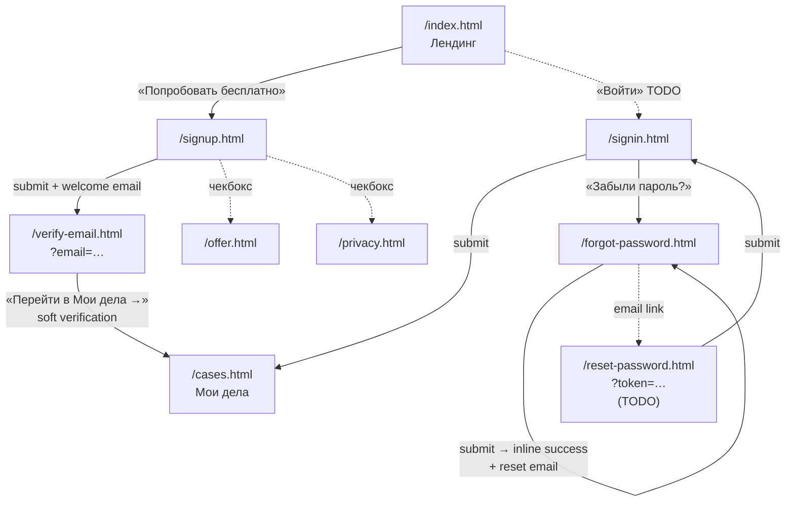

# Регистрация, авторизация и правовые документы — handoff

Документ для разработчика и юриста. Описывает все новые страницы по auth-флоу + правовые документы, логику переходов, принятые UX-решения и что нужно подставить перед публикацией.

- **Live:** https://tuzovgleb.github.io/jhelper-site/
- **Repo:** https://github.com/TuzovGleb/jhelper-site
- **Папка с кодом:** `site/`

---

## 1. Список созданных страниц

### Auth-флоу (4 страницы)

| Файл | Live URL | Назначение |
|---|---|---|
| `signup.html` | [/signup.html](https://tuzovgleb.github.io/jhelper-site/signup.html) | Регистрация: email + пароль + 2 чекбокса согласий |
| `signin.html` | [/signin.html](https://tuzovgleb.github.io/jhelper-site/signin.html) | Вход: email + пароль + «Запомнить меня» + ссылка «Забыли пароль?» |
| `forgot-password.html` | [/forgot-password.html](https://tuzovgleb.github.io/jhelper-site/forgot-password.html) | Запрос сброса: одно поле email. После submit — inline success state |
| `verify-email.html` | [/verify-email.html?email=ivanov@advokat.ru](https://tuzovgleb.github.io/jhelper-site/verify-email.html?email=ivanov@advokat.ru) | Информер «Письмо отправлено на …» с email из URL-параметра |

### Правовые документы (2 страницы)

| Файл | Live URL | Назначение |
|---|---|---|
| `offer.html` | [/offer.html](https://tuzovgleb.github.io/jhelper-site/offer.html) | Договор публичной оферты на оказание услуг (17 разделов) |
| `privacy.html` | [/privacy.html](https://tuzovgleb.github.io/jhelper-site/privacy.html) | Политика обработки ПДн по структуре ст.18.1 152-ФЗ (15 разделов) |

> ⚠️ Обе правовые страницы — **шаблон**, требуют проверки юристом перед публикацией. На каждой странице сверху жёлтый бейдж об этом (скрыт при печати). Все плейсхолдеры в `[квадратных скобках]` подсвечены серым моноширинным шрифтом.

### Общие стили

| Файл | Что |
|---|---|
| `auth.css` | Двух-колоночный layout для всех 4 auth-страниц: тёмная aside слева с radial-градиентом + форма справа. Стек на ≤900px |
| `legal.css` | Узкая читалка (max-width 780px), TOC сверху, print-friendly стили (чёрный текст, скрыта навигация и бейдж) |

---

## 2. Логика переходов

### ASCII-граф (для копипаста в email/мессенджер)

```
┌──────────────────┐
│  /index.html     │  Лендинг
│   (Лендинг)      │
└──┬────────────┬──┘
   │            │
   │ "Попроб.   │ "Войти"
   │  бесплатно"│ (TODO: добавить
   │            │  кнопку в шапке)
   ↓            ↓
┌──────────┐ ┌──────────┐
│ /signup  │ │ /signin  │ ← ── ─ ─ ─ ┐
└────┬─────┘ └────┬─────┘             │
     │            │                   │
     │            │ "Забыли           │
     │            │  пароль?"         │
     │ submit     │                   │
     │ + email    ↓                   │
     │       ┌──────────────┐         │
     │       │ /forgot-     │         │
     │       │  password    │         │
     │       └──────┬───────┘         │
     │              │ submit          │
     │              │ → inline        │
     │              │   success       │
     │              │ + email          │
     │              │   с reset-link  │
     ↓              ↓                  │
┌──────────────┐ (юзер откр. email,   │
│ /verify-email │  кликает ссылку)    │
│  ?email=...  │     ↓                │
└──────┬───────┘  ┌──────────────┐    │
       │          │ /reset-      │    │
       │ "Перейти │  password    │    │
       │  в Мои   │  ?token=...  │    │
       │  дела →" │  TODO        │    │
       │          └──────┬───────┘    │
       │                 │ submit     │
       │                 └────────────┘
       ↓
┌──────────────┐
│ /cases.html  │  Мои дела (главный экран после авторизации)
└──────────────┘
```

### Mermaid-граф (откроется красиво на GitHub)



---

## 3. Принятые UX-решения

| Аспект | Решение | Почему |
|---|---|---|
| Способ входа | **Email + пароль** | Привычно для аудитории (адвокаты 40-55), без зависимостей от соц-провайдеров |
| 2FA | **Нет** | Решение клиента — упрощённый запуск. Можно добавить позже как опциональную в Settings |
| Анкета регистрации | **Только email + пароль** | Минимизация трения. ФИО запрашиваем отложенно — при первом сохранении документа |
| Email-верификация | **Soft** | Пускаем сразу в продукт. Подтверждение нужно только для критичных действий: экспорт документа, оплата |
| Юр-чекбоксы | **2 шт:** «Оферта + ПДн» (обязательный) и «Маркетинг» (опциональный) | По 152-ФЗ согласие active opt-in (без pre-check), маркетинг отдельным чекбоксом |
| Триггер «Попробовать бесплатно» | **Отдельная страница** `/signup` (не модалка) | Больше места для формы и юр-блока, отдельный URL для аналитики |
| После регистрации | **Сразу `/cases.html`** с empty state | Не навязываем wizard опытному юристу |
| Забыл пароль | **Классика:** email со ссылкой → отдельная страница нового пароля | Привычно для аудитории, безопасно (token expiration) |
| Тариф «Команда» | **Отложен** | Сначала запускаем solo-флоу |
| Язык | **Русский** интерфейс, **английские** URL | Стандарт, удобство дев-инструментов |

---

## 4. Email-шаблоны (для бэкенд-разработчика)

### 4.1. Подтверждение email (после `/api/signup`)

**От:** jhelper &lt;noreply@jhelper.ru&gt;
**Тема:** Подтвердите email — jhelper

```
Здравствуйте!

Вы зарегистрировались в jhelper. Подтвердите email, чтобы получить
полный доступ — экспорт документов и оплата подписки.

  → Подтвердить email: https://jhelper.ru/api/verify-email/{token}

Ссылка действует 24 часа.

Если регистрировались не вы — просто проигнорируйте это письмо.

—
jhelper · AI-помощник для адвоката
hello@jhelper.ru · https://jhelper.ru
```

### 4.2. Сброс пароля (после `/api/forgot-password`)

**От:** jhelper &lt;noreply@jhelper.ru&gt;
**Тема:** Сброс пароля — jhelper

```
Здравствуйте!

Вы запросили сброс пароля для аккаунта на jhelper.

  → Сбросить пароль: https://jhelper.ru/reset-password?token={token}

Ссылка действует 24 часа.

Если запрос отправляли не вы — проигнорируйте письмо. Ваш пароль
останется прежним.

—
jhelper · AI-помощник для адвоката
hello@jhelper.ru · https://jhelper.ru
```

---

## 5. Минимальный API-контракт для бэкенда

```http
POST /api/signup
  body: { email, password, agreeTerms: true, agreeMarketing: bool }
  201: { userId } + Set-Cookie: session
  side-effect: отправляется welcome email с verify-token (TTL 24ч)
  errors:
    400 — невалидный email/слабый пароль
    409 — email уже занят

POST /api/signin
  body: { email, password, rememberMe: bool }
  200: { user } + Set-Cookie: session
  errors:
    401 — неверные учётные данные
    423 — аккаунт временно заблокирован после нескольких неудачных попыток

POST /api/forgot-password
  body: { email }
  200: всегда (чтобы не выдавать наличие/отсутствие email в системе)
  side-effect: если email существует — отправляется email с reset-token (TTL 24ч)

POST /api/reset-password
  body: { token, newPassword }
  200: пароль обновлён, все активные сессии инвалидированы
  errors:
    400 — token expired/invalid
    422 — слабый пароль (политика паролей сервера)

GET /api/verify-email/{token}
  302: → /cases.html (с Set-Cookie: session, если auto-login после verify)
  errors:
    400 — token expired → редирект на страницу с предложением запросить новое письмо

POST /api/auth/logout
  204: + Clear-Cookie: session
```

### Политика паролей (рекомендация)

- Минимум 8 символов (на signup стоит `minlength="8"`)
- Хэшировать bcrypt/argon2 + соль
- Rate-limit на `/api/signin` — 5 попыток / 15 мин на email и IP

---

## 6. Правовые документы — что подставить

В файлах `offer.html` и `privacy.html` все плейсхолдеры обёрнуты в `<span class="placeholder">[…]</span>` — найти их можно поиском по символу `[`.

### Список плейсхолдеров

| Плейсхолдер | Где встречается | Пример значения |
|---|---|---|
| `[ИП/ООО Полное наименование]` | offer + privacy | «ИП Иванов Иван Иванович» или «ООО «Дельта»» |
| `[ИНН]` | offer + privacy | 10 цифр (юрлицо) или 12 цифр (ИП) |
| `[ОГРН/ОГРНИП]` | offer + privacy | 13 или 15 цифр |
| `[Юридический адрес]` | offer + privacy | Полный адрес с индексом |
| `[Город]` | offer | «г. Москва» |
| `[Дата вступления в силу]` | offer + privacy | «10 мая 2026 г.» |
| `[Номер]` уведомления Реестра РКН | privacy | После регистрации в Реестре операторов ПДн |
| `[Дата]` уведомления РКН | privacy | Дата подачи уведомления |
| `[2 990 ₽/мес или 29 900 ₽/год]` | offer (тариф «Практика») | Финальная цена |
| `[от 2 490 ₽/мес за пользователя]` | offer (тариф «Команда») | Финальная цена |
| `[N] рабочих дней` | offer (возврат денег) | Например, 10 |
| `[срок, например 3 года]` | privacy (хранение ПДн) | Уточнить с юристом по налог. учёту |
| `[срок, например 30 календарных дней]` | privacy (удаление Контента) | Согласовать SLA |
| `[срок, например 90 календарных дней]` | privacy (резервные копии) | Согласовать с DevOps |
| `[Яндекс.Метрика и/или иные]` | privacy (аналитика) | Финальный список используемых сервисов |

### После подстановки

Передайте мне (или внесите сами) — сделаем прицельный поиск/замену в обоих файлах за один проход.

---

## 7. Что осталось сделать (следующие итерации)

| # | Что | Куда |
|---|---|---|
| 1 | `reset-password.html` — страница установки нового пароля по `?token=…` из email | новый файл |
| 2 | `settings.html` — раздел «Аккаунт»: email, смена пароля, маркетинговые согласия, опасная зона «Удалить аккаунт» | новый файл |
| 3 | Avatar dropdown в шапке `/cases.html` и `/chat.html`: Профиль · Биллинг · Настройки · Выйти | правка существующих |
| 4 | Кнопка «Войти» в шапке `/index.html` рядом с CTA «Попробовать бесплатно» | правка `index.html` |
| 5 | Тариф «Команда»: приглашения по email, роли (owner / member) | новый флоу, отдельная задача |
| 6 | Финализация правовых документов после получения реквизитов | подстановка плейсхолдеров |

---

## 8. Связанные файлы и где искать что

```
site/
├── index.html              ← лендинг (footer: ссылки на /offer, /privacy)
├── cases.html              ← Мои дела (попадают сюда после signin/verify)
├── chat.html               ← Чат внутри дела
│
├── signup.html             ← регистрация (auth.css)
├── signin.html             ← вход (auth.css)
├── forgot-password.html    ← запрос сброса (auth.css)
├── verify-email.html       ← информер (auth.css)
│
├── offer.html              ← оферта (legal.css)
├── privacy.html            ← политика ПДн (legal.css)
│
├── styles.css              ← дизайн-токены и базовые компоненты (общие для всех)
├── auth.css                ← layout auth-страниц
├── cases.css               ← стили /cases.html
├── chat.css                ← стили /chat.html
├── landing.css             ← стили /index.html
└── legal.css               ← узкая читалка + print-friendly для /offer и /privacy
```

Дизайн-токены (цвета, типографика, скругления) — все в `:root` блоке `styles.css`. Бордо-акцент `#7A2E2E`, фон `#FAFAF7`, serif для заголовков (Lora), sans для UI (Inter).

---

## 9. Контакты

Вопросы по содержанию документа или auth-флоу — пишите в работающую по проекту переписку.

Текущая редакция документа: 10 мая 2026 г.
